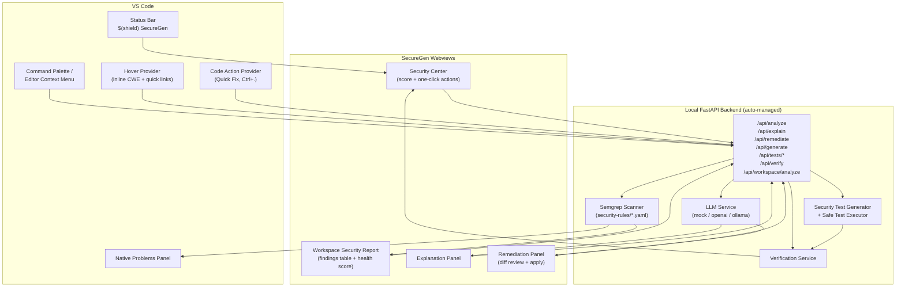

<div align="center">


# 🛡️ SecureGen

### AI-Powered Security for Developers — Directly Inside VS Code

Scan your code for real vulnerability patterns, understand *why* they're dangerous, generate a fix, generate a test that proves the fix works, and verify it — all from the editor, without leaving your flow.

[](https://open-vsx.org/extension/YashPathak1425/securegen)
[](https://open-vsx.org/extension/YashPathak1425/securegen)
[](https://code.visualstudio.com/)
[](secure-coding-extension/vscode-extension/LICENSE)
[](https://semgrep.dev/)
[](https://fastapi.tiangolo.com/)

**[⬇️ Install from Open VSX](https://open-vsx.org/extension/YashPathak1425/securegen)**

**Detect → Understand → Remediate → Test → Verify**

</div>

---

## Why SecureGen

Static analyzers are good at *finding* problems. They're mostly silent about what happens next. The usual loop looks like this:

```
Write code → Run scanner → Read a cryptic rule ID → Search docs → Guess a fix → Hope → Rescan
```

SecureGen keeps that loop, but closes the gaps around it, without ever leaving VS Code:

```
Write code → SecureGen scans it → Explains the finding in plain language →
Generates a remediation → Generates a regression test for it → Re-scans + runs the test to verify
```

Every step above corresponds to a real command in this extension (see [Commands](#-commands)) — nothing here is aspirational. The static scanning is 100% local (Semgrep running against a bundled rule set); the explanation, remediation, and test-generation steps call out to a configurable LLM provider, which defaults to a safe offline mock so the extension is fully usable without any API key.

---

## 📸 Screenshots

This repository doesn't yet ship dashboard screenshots. If you're maintaining this repo, drop images at the paths below — the extension's actual webviews (Security Center, Workspace Report, Explanation panel) are already built and ready to be captured:

| Suggested asset | What to capture |
|---|---|
| `docs/assets/securegen-security-center.png` | The **Security Center** dashboard (`SecureGen: Open Security Dashboard`) — security score, finding counts, action tiles |
| `docs/assets/securegen-finding.png` | A vulnerability surfaced in the native **Problems** panel with the `SecureScan` source label |
| `docs/assets/securegen-explain.png` | The AI **Explanation** panel (root cause / attack vector / prevention) for a finding |
| `docs/assets/securegen-remediate.png` | The **Remediation** panel showing original vs. fixed code with an "Apply" action |
| `docs/assets/securegen-workspace-report.png` | The **Workspace Security Report** with the findings table and health score |

---

## ✨ Features

Every feature below is implemented in the source tree — nothing here is a roadmap item.

### 🔍 Security Scanning
Runs a bundled Semgrep rule set against the current file, a selection, or the entire workspace. Findings are published as native VS Code diagnostics (source: `SecureScan`), so they show up in the **Problems** panel like any other linter/compiler error — no custom UI required to see them.

### 🛡️ Security Center
A single-pane dashboard (`secureScan.openDashboard`) that shows a computed **security score**, a breakdown of critical/high, medium, and low/info findings currently registered in the workspace, and one-click buttons that trigger every other workflow (scan, analyze workspace, explain, remediate, generate tests, verify) without touching the Command Palette.

### 📊 Workspace Security Report
`SecureGen: Analyze Workspace` walks the project (skipping `node_modules`, `.git`, `venv`, build output, etc.), detects the languages and frameworks in use, and renders a report webview with a security health score and a full findings table linked to CWE/MITRE references.

### 🤖 AI-Assisted Security Workflows
Four AI-backed commands, each calling the local FastAPI backend, which in turn calls your configured LLM provider:
- **Explain** — plain-language root cause, attack vector, and prevention guidance for a specific finding
- **Remediate** — a proposed fixed version of the vulnerable code, shown side-by-side for review before you apply it
- **Generate Secure Code** — generate new code against a prompt with security constraints baked into the system prompt
- **Generate Security Tests** — generate a regression test that specifically exercises the vulnerability class that was found

### 🧪 Security Test Generation & Execution
Generated tests are written to a real test file path and can be executed by the backend in an isolated subprocess. Before execution, generated test source is checked against a denylist of destructive shell patterns (`rm -rf`, `chmod 777`, pipe-to-shell, etc.) and blocked if matched.

### ✅ Verification Loop
`SecureGen: Verify Security` re-runs static analysis against the remediated code *and* re-runs the generated regression tests, then reports one of four states: `SECURE_VERIFIED`, `VULNERABILITIES_REMAIN`, `TESTS_FAILED`, or `NOT_FULLY_VERIFIED`. This is the "prove it" step — remediation isn't marked as done just because the LLM said so.

### ⚡ Native VS Code Integration
- **Hover cards** on any flagged line show the CWE, severity, and inline command links (Quick Fix / Generate Test / Explain / MITRE reference)
- **Quick Fix actions** (`Ctrl+.`) offer *Remediate with AI*, *Generate Security Regression Test*, and *Explain with AI* directly on the diagnostic
- **Editor context menu** and **status bar item** ($(shield) SecureGen) give one-click access to the dashboard and workflows
- Optional **scan-on-save** via `secureScan.enableRealTimeScanning`

### 🔐 Local-First Architecture
Static analysis runs entirely on your machine via a bundled Semgrep rule set — no code leaves your device for the scanning step. The extension auto-bootstraps its own FastAPI backend into VS Code's extension storage (Python venv + dependency install) on first run, so there's no separate server to install or manage by hand.

---

## 🧭 Security Coverage

Vulnerability detection is implemented as Semgrep rules under [`security-rules/`](secure-coding-extension/security-rules), with CWE and OWASP metadata attached to every rule.

| Vulnerability | Language(s) | Rule ID | CWE | OWASP (2021) | Severity |
|---|---|---|---|---|---|
| SQL Injection | Python | `python-sql-injection-formatted-query` | CWE-89 | A03:2021 – Injection | ERROR |
| Command Injection | Python | `python-command-injection-os-system` | CWE-78 | A03:2021 – Injection | ERROR |
| Hardcoded Secret | Python | `python-hardcoded-secret-key` | CWE-798 | A07:2021 – Identification & Auth Failures | ERROR |
| Dangerous Code Execution (`eval`/`exec`) | Python | `python-dangerous-eval` | CWE-95 | A03:2021 – Injection | WARNING |
| Path Traversal | Python | `python-path-traversal-open` | CWE-22 | A01:2021 – Broken Access Control | ERROR |
| SQL Injection | JavaScript, TypeScript | `js-sql-injection-concatenated-query` | CWE-89 | A03:2021 – Injection | ERROR |
| Command Injection | JavaScript, TypeScript | `js-command-injection-child-process` | CWE-78 | A03:2021 – Injection | ERROR |
| Hardcoded Secret | JavaScript, TypeScript | `js-hardcoded-secret-key` | CWE-798 | A07:2021 – Identification & Auth Failures | ERROR |
| Dangerous Code Execution (`eval`/`new Function`) | JavaScript, TypeScript | `js-dangerous-eval` | CWE-95 | A03:2021 – Injection | ERROR |
| Path Traversal | JavaScript, TypeScript | `js-path-traversal-fs` | CWE-22 | A01:2021 – Broken Access Control | ERROR |
| Cross-Site Scripting (DOM XSS) | JavaScript, TypeScript | `js-dom-xss-inner-html` | CWE-79 | A03:2021 – Injection | ERROR |

> **This is a pattern-based static analysis engine, not a guarantee of security.** Semgrep rules match known-dangerous code shapes; they can miss vulnerabilities expressed in unusual ways and can occasionally flag safe code. Treat findings as a strong signal to investigate, not a final verdict, and pair SecureGen with code review, dependency scanning, and dynamic testing for full coverage.

---

## 🌐 Supported Languages

| Language | Static Scanning (Semgrep rules) | AI Workflows (explain/remediate/generate/test) | Editor integration (hover, code actions, scan-on-save) |
|---|:---:|:---:|:---:|
| Python | ✅ | ✅ | ✅ |
| JavaScript | ✅ | ✅ | ✅ |
| TypeScript | ✅ | ✅ | ✅ |
| JavaScript React (JSX) | — | — | ✅ (editor integration only) |
| TypeScript React (TSX) | — | — | ✅ (editor integration only) |

Workspace analysis will also *discover* Java, Go, PHP, and Ruby files for project metadata (language/framework detection in the Workspace Security Report), but there are currently no Semgrep rules for those languages, so they are not scanned for vulnerabilities.

---

## 📦 Installation

SecureGen is already published and ready to install — you don't need to build it from source.

**Open VSX (VS Code, VSCodium, Gitpod, Theia, etc.):**
👉 **https://open-vsx.org/extension/YashPathak1425/securegen**

1. Open VS Code (or any Open VSX–compatible editor).
2. Go to the **Extensions** view.
3. Search for **SecureGen**.
4. Click **Install**.
5. Open a project containing Python, JavaScript, or TypeScript code.
6. Run **SecureGen: Open Security Dashboard** from the Command Palette, or click **$(shield) SecureGen** in the status bar.

### First run: local backend setup

SecureGen bundles a FastAPI backend that powers scanning and AI workflows. On first activation, the extension will:

1. Look for a local **Python 3.10+** interpreter (or use the one you set in `secureScan.pythonPath`).
2. Create an isolated virtual environment inside VS Code's extension storage.
3. Install backend dependencies (including Semgrep) into that environment.
4. Start the backend (`uvicorn`) on `127.0.0.1` and wait for it to report healthy.

This happens automatically (`secureScan.autoStartBackend`, default `true`) and only needs to happen once — subsequent sessions reuse the existing environment. If no compatible Python is found, SecureGen will show an error and ask you to install Python 3.10+ before retrying.

**No paid API key is required for scanning.** Static analysis is fully local. AI features work out of the box using a deterministic offline mock provider; connecting a real LLM provider is optional (see [AI Providers](#-ai-providers)).

---

## 🚀 Quick Start

1. Install SecureGen from Open VSX.
2. Open a Python, JavaScript, or TypeScript project in VS Code.
3. Open the Command Palette (`Ctrl+Shift+P` / `Cmd+Shift+P`).
4. Run **`SecureGen: Scan Current File`** or **`SecureGen: Analyze Workspace`**.
5. Open the **Problems** panel to review findings (or open **`SecureGen: Open Security Dashboard`** for the summarized view).
6. Hover a flagged line, or press **`Ctrl+.`** on it, to **Explain**, **Remediate**, or **Generate Security Regression Test**.
7. Review the proposed fix in the Remediation panel and apply it if it looks right.
8. Run **`SecureGen: Verify Security`** to re-scan and re-run the generated tests, confirming the finding is actually resolved.

---

## 🧰 Commands

All commands are registered under the **SecureGen** category and are available from the Command Palette.

| Command ID | Palette Title | What it does |
|---|---|---|
| `secureScan.openDashboard` | SecureGen: Open Security Dashboard | Opens the Security Center webview: score, finding counts, and one-click actions for every workflow below. |
| `secureScan.scanFile` | SecureGen: Scan Current File | Runs the Semgrep rule set against the active editor's file and publishes results as diagnostics. |
| `secureScan.analyzeSelection` | SecureGen: Analyze Selected Code | Scans only the currently selected code range. |
| `secureScan.analyzeWorkspace` | SecureGen: Analyze Workspace | Walks the workspace, detects languages/frameworks, scans discovered files, and opens the Workspace Security Report. |
| `secureScan.explainVulnerability` | SecureGen: Explain Vulnerability with AI | Calls the AI provider to explain a specific finding's root cause, attack vector, and prevention strategy. |
| `secureScan.remediateVulnerability` | SecureGen: Remediate Vulnerability with AI | Generates a proposed secure rewrite of the vulnerable code and shows it in a review panel before applying. |
| `secureScan.generateCode` | SecureGen: Generate Secure Code with AI | Generates new code from a prompt, with security constraints applied by the system prompt. |
| `secureScan.generateTests` | SecureGen: Generate Security Tests | Generates a regression test targeting the specific vulnerability class of a finding. |
| `secureScan.runTests` | *(internal/args-driven)* | Executes a previously generated security test in an isolated subprocess. |
| `secureScan.verifySecurity` | SecureGen: Verify Security | Re-scans the remediated code and re-runs its generated tests to compute a final verification status. |
| `secureScan.clearDiagnostics` | SecureGen: Clear All Diagnostics | Clears all SecureGen diagnostics from every open file. |

Additionally, the editor context menu, editor title bar, and lightbulb Quick Fix menu expose the relevant subset of these commands contextually (e.g. Quick Fix only appears when a `SecureScan` diagnostic exists on that line).

---

## ⚙️ Configuration

Set these under **Settings → Extensions → SecureGen**, or directly in `settings.json`.

| Setting | Default | Description |
|---|---|---|
| `secureScan.backendUrl` | `http://127.0.0.1:8000` | URL of the SecureGen FastAPI backend. Leave as the default to use the auto-managed local backend; set to a different URL to point at a backend you run yourself. |
| `secureScan.enableRealTimeScanning` | `false` | When `true`, automatically re-scans the current file every time it's saved. |
| `secureScan.autoStartBackend` | `true` | Automatically bootstraps and starts the bundled backend when VS Code opens. Set `false` if you want to manage the backend process yourself. |
| `secureScan.pythonPath` | `""` (empty) | Optional path to a specific Python executable used to bootstrap the backend. Leave empty to let SecureGen auto-detect Python 3.10+. |

---

## 🧠 AI Providers

AI-assisted workflows (explain, remediate, generate, test generation) are powered by a pluggable provider layer in the backend, selected via the `LLM_PROVIDER` environment variable read at backend startup:

| Provider | `LLM_PROVIDER` value | Notes |
|---|---|---|
| **Mock (default)** | `mock` (or unset) | Deterministic, fully offline provider. Useful for trying SecureGen without any API key, and for automated testing. Responses are templated, not model-generated. |
| **OpenAI-compatible** | `openai` | Talks to any OpenAI-compatible chat-completions API (OpenAI itself, or compatible self-hosted/gateway endpoints) using `OPENAI_API_KEY`, `OPENAI_BASE_URL`, and `LLM_MODEL`. |
| **Ollama** | `ollama` | Talks to a local Ollama server via `OLLAMA_BASE_URL` and `LLM_MODEL`, for fully local model inference. |

### Environment variables (read by the backend)

| Variable | Default | Purpose |
|---|---|---|
| `LLM_PROVIDER` | `mock` | Selects the provider: `mock`, `openai`, or `ollama`. |
| `LLM_MODEL` | `mock-security-model` | Model name/tag passed to the selected provider. |
| `LLM_TEMPERATURE` | `0.2` | Sampling temperature for AI responses. |
| `LLM_TIMEOUT_SEC` | `45` | Request timeout (seconds) for LLM calls. |
| `OPENAI_API_KEY` | *(none)* | API key for the OpenAI-compatible provider. |
| `OPENAI_BASE_URL` | `https://api.openai.com/v1` | Base URL for the OpenAI-compatible provider — override to point at a compatible gateway. |
| `OLLAMA_BASE_URL` | `http://127.0.0.1:11434` | Base URL for a local Ollama server. |
| `HOST` / `PORT` | `127.0.0.1` / `8000` | Backend bind address/port. |
| `SCAN_TIMEOUT_SEC` | `30` | Timeout for a single Semgrep scan. |
| `MAX_CODE_SIZE_BYTES` | `524288` (512 KB) | Maximum code size accepted per scan/analysis request. |

> ⚠️ **Privacy note:** Static scanning (Semgrep) always runs locally — no source code is sent anywhere for that step. However, if you configure an external provider (`openai`), the vulnerable code snippet and surrounding context **are sent to that provider's API** as part of the explain/remediate/generate/test-generation prompts. Don't point SecureGen at an external provider for code containing secrets or proprietary logic unless that's acceptable under your organization's policy. The `mock` and `ollama` providers keep everything on your machine.

---

## 🏗️ Architecture



**The workflow, end to end:** a diagnostic from the Semgrep scanner shows up natively in the Problems panel *and* is clickable from the Security Center, the Workspace Report, a hover card, or a Quick Fix — four different entry points into the same underlying finding. From any of them you can jump to Explain, Remediate, Generate Tests, or Verify, and the Verification Service closes the loop by re-scanning and re-running tests against the remediated code.

---

## 🧪 Testing

The repository includes its own test suite, separate from the tests SecureGen *generates* for your code:

- `tests/backend/` — Python unit tests for the LLM service, static analysis, workspace analysis, and security-test generation (`test_llm_service.py`, `test_static_analysis.py`, `test_workspace_analysis.py`, `test_security_tests.py`).
- `tests/extension/` — extension-side diagnostics tests (`test_diagnostics.js`).
- `tests/samples/` — intentionally vulnerable and secure Python/JavaScript fixtures (`vulnerable_sample.*`, `secure_sample.*`) used to validate rule accuracy.
- `tests/evaluation/` — an evaluation framework and recorded `results.json` for tracking scanner/LLM accuracy over time.

---

## 🔧 Building from source

```bash
cd secure-coding-extension/vscode-extension
npm install
npm run compile     # tsc -p ./
npm run package      # vsce package → produces securegen-<version>.vsix
```

Backend dependencies (for local development outside the auto-managed venv):

```bash
cd secure-coding-extension/backend
pip install -r requirements.txt
uvicorn app.main:app --reload
```

---

## 📄 License

MIT — see [LICENSE](secure-coding-extension/vscode-extension/LICENSE).

---

<div align="center">

**[Install SecureGen on Open VSX →](https://open-vsx.org/extension/YashPathak1425/securegen)**

</div>
